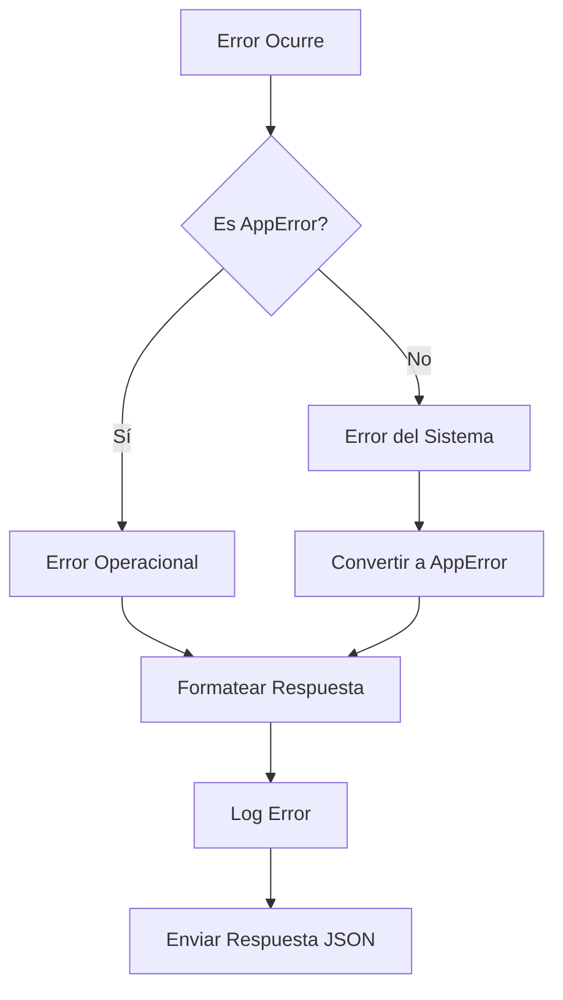

# 📋 Sistema de Manejo de Errores - Documentación

## 📖 Índice

1. [Descripción General](#descripción-general)
2. [Arquitectura](#arquitectura)
3. [Tipos y Interfaces](#tipos-y-interfaces)
4. [Clases de Error](#clases-de-error)
5. [Middleware](#middleware)
6. [Utilidades](#utilidades)
7. [Guía de Uso](#guía-de-uso)
8. [Ejemplos Prácticos](#ejemplos-prácticos)
9. [Configuración](#configuración)
10. [Mejores Prácticas](#mejores-prácticas)

---

## 🎯 Descripción General

Este sistema proporciona un manejo de errores robusto y consistente para la API Express. Incluye:

- ✅ **Tipos de error personalizados** con códigos específicos
- ✅ **Clases de error especializadas** para diferentes escenarios
- ✅ **Middleware global** que captura todos los errores
- ✅ **Manejo automático de errores async/await**
- ✅ **Utilidades** para lanzar errores de manera consistente
- ✅ **Respuestas JSON estandarizadas**
- ✅ **Logging automático** para debugging

---

## 🏗️ Arquitectura
src/core/errors/
├── types/
│   └── errors.ts          # Interfaces y enums
├── AppError.ts            # Clases de error base y específicas
├── middleware/
│   └── errorHandler.ts    # Middleware global de manejo de errores
├── utils/
│   └── errorUtils.ts      # Utilidades para lanzar errores
└── README.md              # Esta documentación


### Flujo de Manejo de Errores



---

## 📝 Tipos y Interfaces

### `ErrorResponse`
Estructura estándar de respuesta de error:

```typescript
interface ErrorResponse {
  success: false;
  error: {
    message: string;
    code: string;
    statusCode: number;
    details?: any;
    stack?: string;  // Solo en desarrollo
  };
  timestamp: string;
  path: string;
}
```

### `AppErrorOptions`
Opciones para crear errores personalizados:

```typescript
interface AppErrorOptions {
  message: string;
  statusCode?: number;
  code?: string;
  details?: any;
  isOperational?: boolean;
}
```

### `ErrorCodes`
Códigos de error estandarizados:

```typescript
enum ErrorCodes {
  // Autenticación
  UNAUTHORIZED = "UNAUTHORIZED",
  FORBIDDEN = "FORBIDDEN",
  TOKEN_EXPIRED = "TOKEN_EXPIRED",
  INVALID_TOKEN = "INVALID_TOKEN",

  // Validación
  VALIDATION_ERROR = "VALIDATION_ERROR",
  INVALID_INPUT = "INVALID_INPUT",
  MISSING_REQUIRED_FIELD = "MISSING_REQUIRED_FIELD",

  // Recursos
  NOT_FOUND = "NOT_FOUND",
  ALREADY_EXISTS = "ALREADY_EXISTS",
  CONFLICT = "CONFLICT",

  // Servidor
  INTERNAL_SERVER_ERROR = "INTERNAL_SERVER_ERROR",
  DATABASE_ERROR = "DATABASE_ERROR",
  EXTERNAL_SERVICE_ERROR = "EXTERNAL_SERVICE_ERROR",

  // Rate Limiting
  TOO_MANY_REQUESTS = "TOO_MANY_REQUESTS",

  // Negocio
  BUSINESS_RULE_VIOLATION = "BUSINESS_RULE_VIOLATION",
  INSUFFICIENT_PERMISSIONS = "INSUFFICIENT_PERMISSIONS"
}
```

---

## 🎭 Clases de Error

### `AppError` (Clase Base)
Error base para todos los errores operacionales:

```typescript
class AppError extends Error {
  public readonly statusCode: number;
  public readonly code: string;
  public readonly isOperational: boolean;
  public readonly details?: any;

  constructor(options: AppErrorOptions)
}
```

### Clases Específicas

| Clase | Status Code | Uso |
|-------|-------------|-----|
| `ValidationError` | 400 | Errores de validación de datos |
| `UnauthorizedError` | 401 | Usuario no autenticado |
| `ForbiddenError` | 403 | Usuario sin permisos |
| `NotFoundError` | 404 | Recurso no encontrado |
| `ConflictError` | 409 | Conflictos de datos |
| `DatabaseError` | 500 | Errores de base de datos |
| `ExternalServiceError` | 502 | Errores de servicios externos |
| `BusinessRuleError` | 422 | Violación de reglas de negocio |

#### Ejemplos de Uso:

```typescript
// Error de validación
throw new ValidationError("Email is required", { field: "email" });

// Recurso no encontrado
throw new NotFoundError("User");

// Error de negocio
throw new BusinessRuleError("Cannot delete user with active orders");
```

---

## ⚙️ Middleware

### `globalErrorHandler`
Middleware principal que captura y procesa todos los errores:

**Características:**
- Detecta errores operacionales vs errores del sistema
- Formatea respuestas consistentes
- Maneja errores específicos (Mongoose, JWT, JSON syntax)
- Logging automático
- Stack trace solo en desarrollo

### `asyncHandler`
Wrapper para funciones async que captura errores automáticamente:

```typescript
export const getUserById = asyncHandler(async (req, res) => {
  // Tu código async aquí
  // Los errores se capturan automáticamente
});
```

### `notFoundHandler`
Middleware para rutas no encontradas:

```typescript
app.use(notFoundHandler); // Debe ir antes del globalErrorHandler
```

---

## 🛠️ Utilidades

### `throwError`
Objeto con métodos para lanzar errores específicos:

```typescript
throwError.validation("Email is required");
throwError.notFound("User");
throwError.unauthorized();
throwError.forbidden("Insufficient permissions");
throwError.conflict("Email already exists");
throwError.database("Connection failed");
throwError.externalService("PaymentAPI", "Service unavailable");
throwError.businessRule("Cannot process refund");
throwError.custom("Custom error", 418, "CUSTOM_CODE");
```

### Funciones de Validación

#### `assertExists<T>`
Valida que un valor no sea null o undefined:

```typescript
const user = assertExists(foundUser, "User is required");
```

#### `assertResourceExists<T>`
Valida que un recurso exista:

```typescript
const user = assertResourceExists(foundUser, "User");
```

#### `assertPermission`
Valida permisos de usuario:

```typescript
assertPermission(canEdit, "Cannot edit this resource");
```

#### `assertAuthenticated`
Valida autenticación:

```typescript
assertAuthenticated(isLoggedIn, "Login required");
```

---

## 📚 Guía de Uso

### 1. Configuración en Express

```typescript
import { globalErrorHandler, notFoundHandler } from '@/core/errors/middleware/errorHandler';

// ... otros middlewares

// Rutas
app.use('/api', routes);

// Middleware para rutas no encontradas
app.use(notFoundHandler);

// Middleware global de errores (DEBE SER EL ÚLTIMO)
app.use(globalErrorHandler);
```

### 2. En Controladores

```typescript
import { asyncHandler } from '@/core/errors/middleware/errorHandler';
import { throwError, assertResourceExists } from '@/core/errors/utils/errorUtils';

export const getUserById = asyncHandler(async (req, res) => {
  const { id } = req.params;

  // Validación
  if (!id) {
    throwError.validation('User ID is required');
  }

  // Buscar usuario
  const user = await User.findById(id);
  
  // Verificar existencia
  assertResourceExists(user, 'User');

  res.json({ success: true, data: user });
});
```

### 3. En Servicios

```typescript
import { throwError } from '@/core/errors/utils/errorUtils';

export class UserService {
  async createUser(userData: CreateUserDto) {
    // Validar email único
    const existingUser = await this.findByEmail(userData.email);
    if (existingUser) {
      throwError.conflict('Email already exists', { email: userData.email });
    }

    try {
      return await User.create(userData);
    } catch (error) {
      throwError.database('Failed to create user', error);
    }
  }
}
```

---

## 💡 Ejemplos Prácticos

### Ejemplo 1: CRUD de Usuarios

```typescript
// controllers/userController.ts
import { asyncHandler } from '@/core/errors/middleware/errorHandler';
import { throwError, assertResourceExists } from '@/core/errors/utils/errorUtils';

export const createUser = asyncHandler(async (req, res) => {
  const { email, name, password } = req.body;

  // Validaciones
  if (!email || !name || !password) {
    throwError.validation('Email, name and password are required', {
      missingFields: [
        !email && 'email',
        !name && 'name',
        !password && 'password'
      ].filter(Boolean)
    });
  }

  // Verificar email único
  const existingUser = await User.findOne({ email });
  if (existingUser) {
    throwError.conflict('User with this email already exists', { email });
  }

  // Crear usuario
  const user = await User.create({ email, name, password });

  res.status(201).json({
    success: true,
    data: user
  });
});

export const getUserById = asyncHandler(async (req, res) => {
  const { id } = req.params;

  const user = await User.findById(id);
  assertResourceExists(user, 'User');

  res.json({
    success: true,
    data: user
  });
});

export const updateUser = asyncHandler(async (req, res) => {
  const { id } = req.params;
  const updates = req.body;

  const user = await User.findById(id);
  assertResourceExists(user, 'User');

  // Verificar permisos
  if (req.user.id !== id && !req.user.isAdmin) {
    throwError.forbidden('Cannot update other users');
  }

  const updatedUser = await User.findByIdAndUpdate(id, updates, { new: true });

  res.json({
    success: true,
    data: updatedUser
  });
});
```

### Ejemplo 2: Manejo de Pagos

```typescript
// services/paymentService.ts
import { throwError } from '@/core/errors/utils/errorUtils';

export class PaymentService {
  async processPayment(paymentData: PaymentDto) {
    try {
      // Validar monto
      if (paymentData.amount <= 0) {
        throwError.validation('Amount must be greater than 0');
      }

      // Verificar fondos suficientes
      const account = await this.getAccount(paymentData.accountId);
      if (account.balance < paymentData.amount) {
        throwError.businessRule('Insufficient funds', {
          required: paymentData.amount,
          available: account.balance
        });
      }

      // Procesar con servicio externo
      const result = await this.externalPaymentAPI.charge(paymentData);
      
      if (!result.success) {
        throwError.externalService('PaymentAPI', result.error);
      }

      return result;

    } catch (error) {
      if (error instanceof AppError) {
        throw error; // Re-lanzar errores operacionales
      }
      
      // Error inesperado
      throwError.database('Payment processing failed', error);
    }
  }
}
```

### Ejemplo 3: Middleware de Autenticación

```typescript
// middleware/auth.ts
import { asyncHandler } from '@/core/errors/middleware/errorHandler';
import { throwError, assertAuthenticated } from '@/core/errors/utils/errorUtils';

export const requireAuth = asyncHandler(async (req, res, next) => {
  const token = req.headers.authorization?.replace('Bearer ', '');

  if (!token) {
    throwError.unauthorized('Access token required');
  }

  try {
    const decoded = jwt.verify(token, process.env.JWT_SECRET);
    const user = await User.findById(decoded.id);
    
    assertAuthenticated(!!user, 'Invalid token');
    
    req.user = user;
    next();
  } catch (error) {
    if (error.name === 'TokenExpiredError') {
      throwError.unauthorized('Token expired');
    }
    throwError.unauthorized('Invalid token');
  }
});

export const requireRole = (roles: string[]) => {
  return asyncHandler(async (req, res, next) => {
    assertAuthenticated(!!req.user, 'Authentication required');
    
    const hasRole = roles.includes(req.user.role);
    if (!hasRole) {
      throwError.forbidden(`Requires one of: ${roles.join(', ')}`);
    }
    
    next();
  });
};
```

---

## ⚙️ Configuración

### Variables de Entorno

```env
NODE_ENV=development  # Controla si se muestra stack trace
LOG_LEVEL=error      # Nivel de logging
```

### Personalización del Logger

```typescript
// En errorHandler.ts, puedes reemplazar el logger simple:
import winston from 'winston';

const logger = winston.createLogger({
  level: process.env.LOG_LEVEL || 'error',
  format: winston.format.json(),
  transports: [
    new winston.transports.File({ filename: 'error.log', level: 'error' }),
    new winston.transports.Console()
  ]
});
```

---

## ✅ Mejores Prácticas

### 1. **Usa errores específicos**
```typescript
// ❌ Malo
throw new Error('Something went wrong');

// ✅ Bueno
throwError.validation('Email format is invalid', { email });
```

### 2. **Proporciona contexto útil**
```typescript
// ❌ Malo
throwError.notFound('User');

// ✅ Bueno
throwError.notFound(`User with ID ${userId}`);
```

### 3. **Incluye detalles relevantes**
```typescript
throwError.conflict('Email already exists', {
  email: userData.email,
  existingUserId: existingUser.id
});
```

### 4. **Usa asyncHandler para funciones async**
```typescript
// ✅ Siempre envuelve controladores async
export const myController = asyncHandler(async (req, res) => {
  // Tu código aquí
});
```

### 5. **Valida temprano y frecuentemente**
```typescript
// Validar al inicio de la función
if (!id) throwError.validation('ID is required');

// Validar recursos
const user = assertResourceExists(await User.findById(id), 'User');

// Validar permisos
assertPermission(canEdit, 'Cannot edit this resource');
```

### 6. **Maneja errores de servicios externos**
```typescript
try {
  const result = await externalAPI.call();
} catch (error) {
  throwError.externalService('ExternalAPI', 'Service unavailable', error);
}
```

### 7. **Usa códigos de error consistentes**
```typescript
// Siempre usa los códigos definidos en ErrorCodes
throwError.custom('Custom error', 400, ErrorCodes.VALIDATION_ERROR);
```

---

## 🔍 Respuestas de Error

### Formato Estándar

```json
{
  "success": false,
  "error": {
    "message": "User not found",
    "code": "NOT_FOUND",
    "statusCode": 404,
    "details": {
      "userId": "123"
    }
  },
  "timestamp": "2024-01-15T10:30:00.000Z",
  "path": "/api/users/123"
}
```

### Ejemplos por Tipo de Error

#### Validación (400)
```json
{
  "success": false,
  "error": {
    "message": "Email and name are required",
    "code": "VALIDATION_ERROR",
    "statusCode": 400,
    "details": {
      "missingFields": ["email", "name"]
    }
  },
  "timestamp": "2024-01-15T10:30:00.000Z",
  "path": "/api/users"
}
```

#### No Autorizado (401)
```json
{
  "success": false,
  "error": {
    "message": "Access token required",
    "code": "UNAUTHORIZED",
    "statusCode": 401
  },
  "timestamp": "2024-01-15T10:30:00.000Z",
  "path": "/api/protected"
}
```

#### Conflicto (409)
```json
{
  "success": false,
  "error": {
    "message": "Email already exists",
    "code": "CONFLICT",
    "statusCode": 409,
    "details": {
      "email": "user@example.com"
    }
  },
  "timestamp": "2024-01-15T10:30:00.000Z",
  "path": "/api/users"
}
```

---

## 🚀 Próximas Mejoras

- [ ] Integración con sistemas de monitoreo (Sentry, DataDog)
- [ ] Métricas de errores
- [ ] Rate limiting por tipo de error
- [ ] Notificaciones automáticas para errores críticos
- [ ] Validación con esquemas (Joi, Zod)
- [ ] Internacionalización de mensajes de error

---
